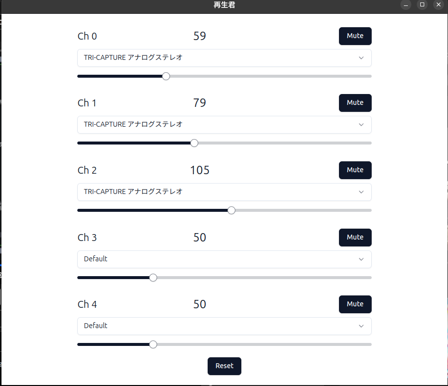

## AI Tuberのために音声再生ソフトを作った話

# 前置き
この記事はQiita Advent Calendar 2025 / ひとりアドベントカレンダー 分野における ふぐおの配信関係多めひとり Advent Calendar 2025 の6 日目記事となります。  

https://qiita.com/advent-calendar/2025/fuguo_2025

こんにちは! AI Tuberなどの開発をしているふぐおです。
**AI Tuber**において、皆さんはどのようにして**音声を再生させているでしょうか？**   
あまり、これについて触れている方がいらっしゃらないので、私の現在のやり方を共有します。  

# CLIも悪くはないけど...
## CLIは手軽という話
音声再生ソフトにはCLIから利用できるものもあり、ファイル名を指定するだけで、音声を再生できるので簡単です。  
当初は私もCLIの音声再生ソフトを利用していました。  

## おすすめのCLI音声再生その1: VLC media player
皆がとりあえず入れてるVLC media playerもCLIから利用できます。  

```bash
"C:/Program Files/VLC/vlc.exe" --play-and-exit --gain=1.5 ./hoge.wav
```

ただ、VLCをCLIから利用すると画面は表示されませんが、**タスクバーに一瞬アイコンが表示**されてしまうのが気になります。  

## おすすめのCLI音声再生その2: FFPlay
FFmpegに付属しているFFPlayもCLIから利用できます。  

```bash
ffplay -autoexit -nodisp ./hoge.wav
```

VLCと違い、タスクバーにアイコンが表示されないので、こちらの方が**おすすめ**です。  

## CLIのデメリット
CLIは手軽ですが、**OBSのアプリケーション音声キャプチャが使用できない**というデメリットがあります。  
OBSのアプリケーション音声キャプチャは、**GUIアプリが対象**になっています。  
アプリケーションごとに音声をキャプチャできると、配信で流したくない音をデスクトップ音声に流している場合に特に重宝します。  
また、**配信に聞こえる音をアプリごとにコントロール**できたり、**録画データにはこの音を入れない**といった場面にも使えます。  

# アプリケーションキャプチャを使用できる音声再生ソフトを自作した
## 名付けて「再生君」
アプリケーションキャプチャを使いたくなったので、音声再生ソフトを自作しました。  
見た目はこんな感じです。  


## 使い方
このアプリを起動すると、REST APIサーバーが立ち上がります。  
ここに、**音声データをPOSTすることで、音声を再生**できます。  

## 機能1: 再生時の自由な音量コントロール
私の配信では、コメントの読み上げ音声(これも自作)とAI Tuberの音声が飛び交っています。  
AIの音量をちょっと小さくして、コメントの読み上げをちょっと大きくしたい、といったことがよくあります。  
こういうときは、チャンネル1をAI、チャンネル2をコメント読み上げとしてやれば、**音声のボリュームを自由にコントロール**できます。  
また、**ミュートボタン**もつけているので、急に音を消したいときにも便利です。  

## 機能2: キュー機能
コメント読み上げとAI Tuberを同時に運用していると、AI Tuberが喋っている時にコメントは読み上げしてほしくないといったことがあります。  
コメントの読み上げプログラムとAI Tuberが相互に連携を取って...みたいなことを始めると大変です。  
しかし、この再生君なら**キュー機能を使って、音声を順番に再生**できます。  
また、私は時々Webページの読み上げをずんだもんに代行させています。ずんだもんの読み上げに対して、コメントはどんどん被せてもらって構いません。こういうキューを独立させたいなといったときでも、このアプリは**2つキューを備えている**ので、安心です。  

## 使ったもの
このアプリは**Electron**製です。  
LinuxやWindowsで動くので、どちらの環境でも配信する私にぴったり。

以下に使ったライブラリ等を列挙します。
- Web Audio API: 音声再生
- Hono: REST APIサーバー
- React: UI

Web Audio APIむずかった...

# まとめ
アプリは欲しくなったら作ればいい

# リポジトリ
ビルドしたものもなければ、ドキュメントもないですが、一応貼っときます。  

https://github.com/boxfish-jp/audio_player

# おまけ
ニコ生で毎日ライブコーディングしてます。来てね。

https://www.nicovideo.jp/user/98746932/live_programs?ref=watch_user_information
