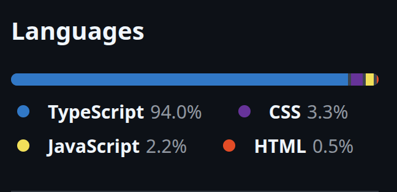
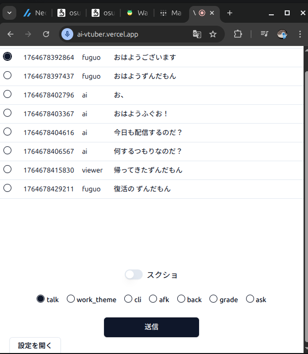

# パートナー型AI Tuberの会話履歴作りのウラガワをお見せします

# 前置き
この記事はQiita Advent Calendar 2025 / ひとりアドベントカレンダー 分野における ふぐおの配信関係多めひとり Advent Calendar 2025 の3日目記事となります。  

https://qiita.com/advent-calendar/2025/fuguo_2025

こんにちは! AI Tuberなどの開発をしているふぐおです。  
今日は、私が作っているパートナー**AI Tuberの会話履歴作りのウラガワ**をお見せします。  
AI Tuberを作っている方々の参考になれば幸いです。  

# 使用している言語やフレームワークなど
全ては紹介できませんが、ポイントに絞ってお伝えします。  
## 言語
100%**TypeScript**製です。  

昔は全部Pythonで書いてましたが、開発初期段階くらいからTypeScriptに移行しました。  
私があまりPythonが好きじゃないのと、DBとかRESTとかをガンガン使うと**スキーマが大事**になってくるので、**型安全**なTypeScriptの方が向いていると感じたからです。  

## LLM周りの処理
LLM周りの処理は**LangChain.js**を使っています。  
Pythonよりも若干機能追加が遅いですが、特に問題なく使えます。  
LangChainを使う**メリット**としては、**ローカルLLMも含め様々なモデルを簡単に切り替えられる**ことです。  
それ以外はあんまり使いこなせてないかも、誰か教えて。  

## フロントエンド
このあとWebアプリが登場しますが、**React**製です。  
フロントは他にも色々使ってますが、無限にあるので、これくらいにしておきます。  

# LangChainでのプロンプトの運用方法
## Role機能は使えないというお話

LangChainを普通に使用する場合は、以下のようにユーザーかAIかを設定して書くと、AIがうまくそれを理解する**ロール**という機能があります。  
```ts
system_msg = SystemMessage("You are a helpful assistant.")
human_msg = HumanMessage("Hello, how are you?")

messages = [system_msg, human_msg]
response = model.invoke(messages)  
```

ところが、以下の制約が発生します。  
- 一人のユーザーと一対一の対話が前提になる。  
- ユーザーとAIは交互に対話しなければならない。(少なくともGeminiはこの縛りがある)  

こうなると、複数のユーザーがコメントする状況をAIが理解できなかったり、コメントが来ないときにAIが連続して話をするといったことに対応できなくなります。

## 妥協策
この制限があるので、**会話履歴はメッセージプロンプトに入れています**。  
私の今のAIずんだもんは、口調さえ守っていればいいかなくらいで自由に発言させる場合は不要ですが、ガチガチに設定を守らせて、発言をさせたい場合はシステムプロンプトをちゃんと入力することが大事です。  
同じ文でもシステムプロンプトに書くべき文を、メッセージプロンプトに入れていると、指示の追従性が著しく下がります。
ちなみに、メッセージプロンプトに入れるのも微妙っちゃ微妙です。ずんだもん「~~」みたいな一人芝居を始めてしまうことがあるので、これも対策しなきゃいけない。会話履歴の文体に囚われた出力をしちゃってるんでしょうね。  
なにか良い方法知っている人教えてほしい。  

# コンテキスト(会話履歴)管理Webアプリ 
## 手動管理の必要性
私のAI Tuberでは、コンテキスト(会話履歴)の管理を自動化と手動管理を併用しています。  
コンテキストの手動管理が必要な理由については、以下の記事をご覧ください。  

https://qiita.com/boxfish_jp/items/39b690de88914238b4b9

## Webアプリ画面
Webアプリの画面はこんな感じです。  
  
表みたいなUIになっていて、AIちゃん、私(ふぐお)、コメントの誰かが発言するたびにポンポン行が追加されていきます。  
**送りたい会話履歴の始まりの行をクリック**すると、そこから下の会話履歴がすべてWebSocketでAIに送られAIが推論し、発言をします。  
**サッとクリックするだけ**なので、手軽で面倒くさくありません。  
また、このWebアプリは裏で音声認識をしていて、私が話した内容を自動でテキスト化して行に追加しています。  
音声認識について気になる方は以下の記事をご覧ください。  
ちなみにこのアプリはコンテキスト管理以外にも色々機能があるので、今度紹介します。 

https://qiita.com/boxfish_jp/items/578b74f5878e348cba99

# まとめ
- 会話履歴の管理は操作数の少なさにこだわったWebアプリで操作すると便利。  
- LangChainは便利なようで不便。でも、モデルの切り替えが簡単なのは偉大。  

# おまけ
ニコ生で毎日ライブコーディングしてます。来てね。

https://www.nicovideo.jp/user/98746932/live_programs?ref=watch_user_information
