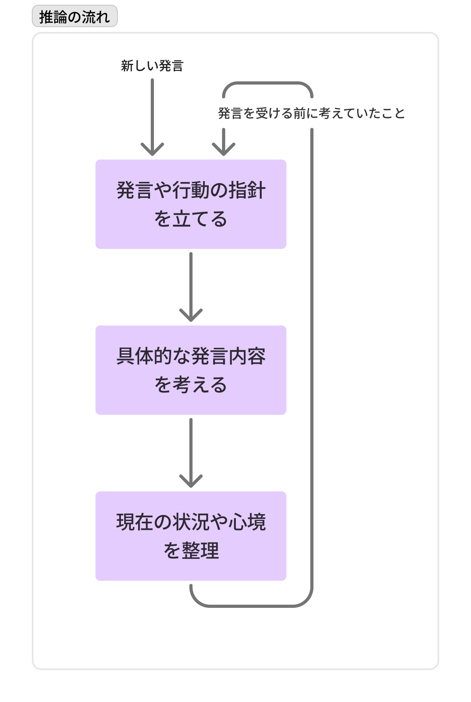

# 【AI Tuber】分けて推論vs一括で推論どっちが速い？

## 前置き

この記事は [Qiita Advent Calendar 2025 ふぐおの配信関係多めひとり Advent Calendar 2025]() および、[AIパートナー・AIキャラ・AIVtuber Advent Calendar 2025](https://qiita.com/advent-calendar/2025/ai-character) の14日目の記事となります。

https://qiita.com/advent-calendar/2025/fuguo_2025

こんにちは！ AI Tuberなどの開発をしているふぐおです。

以前、私が開発しているパートナーAI Tuberでは、**「思考」と「発言」などの推論プロセスを多段階に分けることで、生成される文の品質を担保していました**。一括で指示すると、指示漏れやキャラ崩壊が起きやすかったためです。

しかし、モデルの性能は日々進化しています。
現在でも**この「分割手法」は必要なのか？ それとも一括で推論させた方が速くて効率的なのか？**
最新モデルを用いて改めて検証してみました。

AI Tuberを作っている方々の参考になれば幸いです。

## 今回使用するモデルについて

検証には **Gemini-2.5-Flash-Lite** を使用します。
今回は応答速度を重視するため、長考（推論）モデルは使用しません。

## 今回の推論の流れの確認

### 全体の流れ

現在私が実装している基本的な推論フローは、上記の図の通りです。
実際の実装では、ここからさらに「ツール呼び出し」が発生したり、条件によって発言するかしないかが**分かれますが**、基本構造はこのようになっています。



### 1. 発言や行動の指針を立てる

パートナー型AI Tuberは、視聴者と一対一で会話するチャットボットよりも文脈が複雑になりがちです。
発言の安定性を高めるため、いきなりセリフを出力させるのではなく、「現在はどのような場面か」「どのようなスタンスで発言すべきか」という**指針**をまず考えさせています。
入力には、直前までの思考内容と、会話履歴を含めます。

### 2. 具体的な発言内容を考える

ステップ1で立てた指針を元に、キャラクターになりきった具体的な発言内容を生成させます。

### 3. 現在の状況や心理を整理

AI自身の発言完了後、その発言内容を元に「今自分は何を考えているか」を再整理させます。
ここで出力された思考データは、**次回の**発言や行動の指針を立てる際に（ステップ1の入力として）使用します。

## 今回の比較に用いるプロンプト例

このフローを「一回のリクエストで全部やる」か「ステップごとにリクエストを分ける」かで比較します。

### 一括で推論する場合

```txt
とあるAIパートナーは今ふぐおという配信者とライブコーディングをしています。
AIパートナーはアシスタント的な役割です。
以下が直近の会話履歴です。

コメント「わこつ。腱鞘炎治った?」
ふぐお「いらっしゃい。全然症状変わらないよ」
ふぐお「でも、腱鞘炎なわけないよ。だってまだ23だし」
コメント「もうおじさんなんだよ」
ふぐお「そ、そんなわけ。AIちゃんは私のことおじさんだとは思わないよね」

以下が直近でAIパートナーが考えていたことです。
ふぐおのプログラミング配信に視聴者が来場したようです。

これに対して以下の出力を行ってください。
1文目に、AIパートナーが直前で考えていたことが、ふぐお、または視聴者の新しい発言によってどのように変化したかを述べてください。
2文目は、AIパートナーが次にどのような発言や行動をするべきかと注意点を述べてください。
3文目に、2文目の内容を踏まえて、AIパートナーが実際にする発言をなりきって出力してください。
4文目に、3文目でおこなった発言をもとにAIパートナーが現在どのようなことを考えているかを述べてください。
```

### 分けて推論する場合

※実験では以下の3段階にリクエストを分割しました。

#### 共通のプロンプト（コンテキスト）

```txt
とあるAIパートナーは今ふぐおという配信者とライブコーディングをしています。
AIパートナーはアシスタント的な役割です。
以下が直近の会話履歴です。

コメント「わこつ。腱鞘炎治った?」
ふぐお「いらっしゃい。全然症状変わらないよ」
ふぐお「でも、腱鞘炎なわけないよ。だってまだ23だし」
コメント「もうおじさんなんだよ」
ふぐお「そ、そんなわけ。AIちゃんは私のことおじさんだとは思わないよね」

これに対して以下の出力を行ってください。
```

#### 1回目：発言や行動の指針を立てる

```txt
${共通のプロンプト}

以下が直近でAIパートナーが考えていたことです。
ふぐおのプログラミング配信に視聴者が来場したようです。

最初の一文目にAIパートナーが直前で考えていたことが、ふぐお、または視聴者の新しい発言によってどのように変化したかを述べてください。
```

#### 2回目：発言生成

```txt
${共通のプロンプト}

これに対して、以下がAIパートナーが考えている会話の方針や注意点です。
${1回目の出力結果}

AIパートナーが実際にする発言をなりきって出力してください。
```

#### 3回目：現在の状況や心境を整理

```txt
${共通のプロンプト}

これに対して、以下がAIパートナーが考えている会話の方針や注意点です。
${1回目の出力結果}

これらを踏まえて、実際にAIパートナーが行った発言は以下です。
${2回目の出力結果}

実際におこなった発言をもとにAIパートナーが現在どのようなことを考えているかを述べてください。
```

## 結果

### 出力時間

15回ほど試行して平均を取りました。

  * **一括で推論:** 平均 **2.3秒**
  * **分けて推論:** 平均 **4.0秒**

**一括で出力する方が圧倒的に速い**ことが分かりました。

以前（2024年3月頃）同様の検証をした際は、分けて推論したほうが「無駄な思考トークンの出力」が減り、トータルでは速くなるケースもありました。
しかし現在はモデルの生成速度自体が非常に高速化しています。その結果、生成時間の短縮効果よりも、**サーバーへ複数回アクセスする通信のオーバーヘッド（RTT）の方が、全体の処理時間に大きく影響している**と考えられます。

### 出力された言葉

一括の場合も分けて出す場合も、出力内容に大きな差はありませんでした。

**一括推論の出力例：**

> 「ふぐおさん、もちろんおじさんだなんて思ってませんよ！まだお若いですからね。さあ、このコードの続き、どこから実装していきましょうか？」

**分割推論の出力例：**

> 「ふぐおさん、おじさんだなんてとんでもないですよ！まだまだお若いですし、エネルギッシュに配信されている姿、いつも拝見しています。視聴者の方も、ふぐおさんの魅力に惹かれている方がたくさんいらっしゃいますから、年齢なんて関係ないと思います！」

出力文のクオリティもほぼ同等と言えます。

## まとめ

検証の結果、以下のことが分かりました。

  * **速度重視なら一括推論：**
    出力のクオリティに大差はなく、同程度のトークン量が見込まれるなら、一括でリクエストするほうが高速です。APIリクエストの往復回数を減らすことが、遅延対策として重要になっています。
  * **柔軟性重視なら分割推論：**
    速度では劣りますが、ワークフローの途中で「ツール呼び出し（Web検索など）」や「音声再生の先行開始」などを挟みたい場合は、分割するメリットが依然としてあります。

AI Tuberの「性格」や「求められる反応速度」に合わせて、使い分けていくのが良さそうです。

## 感想
Geminiの生成速度が非常に速くなっており、驚きました。  
前は音声の応答を早くするために色々工夫をしていましたが、今後はあまり気にしなくても良さそうです。  
