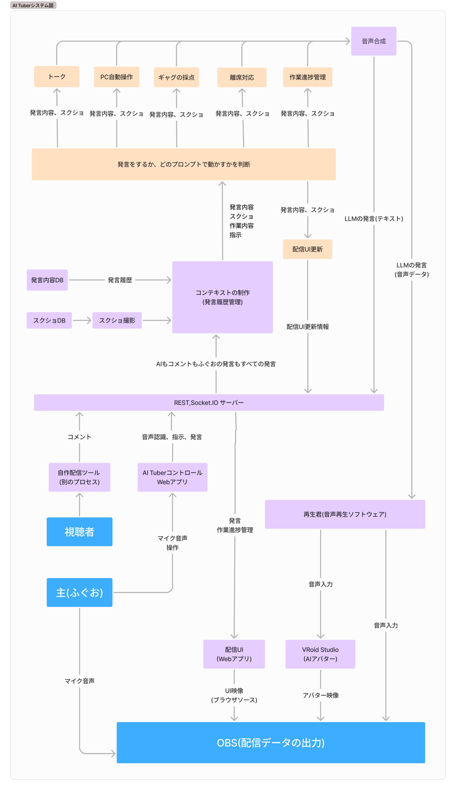
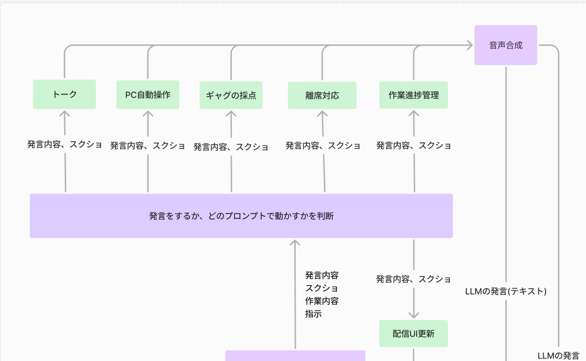

# 作った配信パートナーAI Tuberのシステム図を紹介するよ！

# はじめに

この記事はQiita Advent Calendar 2025 / ひとりアドベントカレンダー 分野における ふぐおの配信関係多めひとり Advent Calendar 2025 の9日目の記事となります。  

https://qiita.com/advent-calendar/2025/fuguo_2025

こんにちは! AI Tuberなどの開発をしているふぐおです。  
今回は、私が作った**AI Tuberのシステム図**について紹介したいと思います。  

# 現在のAI Tuberシステムの機能
- AIが私の声と、視聴者のコメントを認識  
- AIのアバターのリップシンク  
- 自律的に思考し、発話する  
- 字幕表示  
- PCを自動操作する
- 私が黙っているときに、話題を振る
- 視聴者のギャグを採点する
- 作業の進捗状況を聞く
- 配信UIを操作する
- 私が離席するときに声をかける
- デスクトップのスクショを取り、スクショに基づいて発言する

動作を見たいかたは以下の動画をご覧ください。  

https://youtu.be/sDGx7GBClS4

設計背景は以下の記事をご覧ください。  

https://note.com/boxfish_jp/n/naa1f871baf36

# システム図
  

**青色**が登場人物で、今回は**視聴者と私とOBS**です。  
**他の四角についてはコンポーネント**です。自作のコードだったり、ソフトウェアだったりしますが、今回は**責任(仕事)に着目**して分けました。  
コンポーネント間で矢印が結ばれており、矢印の途中にかかれているテキストの通りのデータが流れています。  
これらのコンポーネントは、単に関数呼び出しだったり、RESTだったり、音声入力だったり様々です。  
**薄いオレンジの四角の部分はLLMの推論が行われる部分**です。  

# こだわり
**無駄な概念やデータ交換が行われていないかを見直し**、きれいなコンポーネント群になるように設計しました。
同時に、機能の追加や変更のしやすさを重視して、**なるべく単一の責任や仕事ごとにコンポーネントを分ける**ことを意識しました。  

例えば、上の図の**緑の部分はAIのスキル**的な部分です。  
ここのスキルに関しては、LLMのプロンプトを調整したり、新たにスキルを追加することなどが頻繁に行われるので、変更や追加をしやすいコンポーネント分けになっています。  

スキル以外の箇所だと、AIもコメントも音声認識データも全て一つの経路を通り、DBへの登録やコンテキストの作成が行われることでコードがシンプルになり、分かりやすく、メンテナンス性の向上に寄与しています。  

# その他技術的な詳細について
## 音声認識

https://qiita.com/boxfish_jp/items/578b74f5878e348cba99

## AI TuberコントロールWebアプリ

https://qiita.com/boxfish_jp/items/1226527d054635c3565a

## コンテキストの制作

https://qiita.com/boxfish_jp/items/39b690de88914238b4b9

## 再生君(音声再生ソフトウェア)

https://qiita.com/boxfish_jp/items/f2bd0d23337f9e0847b1

## 配信UI
以下の記事を応用しています。  

https://qiita.com/boxfish_jp/items/1ba6e22a3667f295a0fe

# まとめ
メンテナンスしやすいコードを心がけていきたい。  
