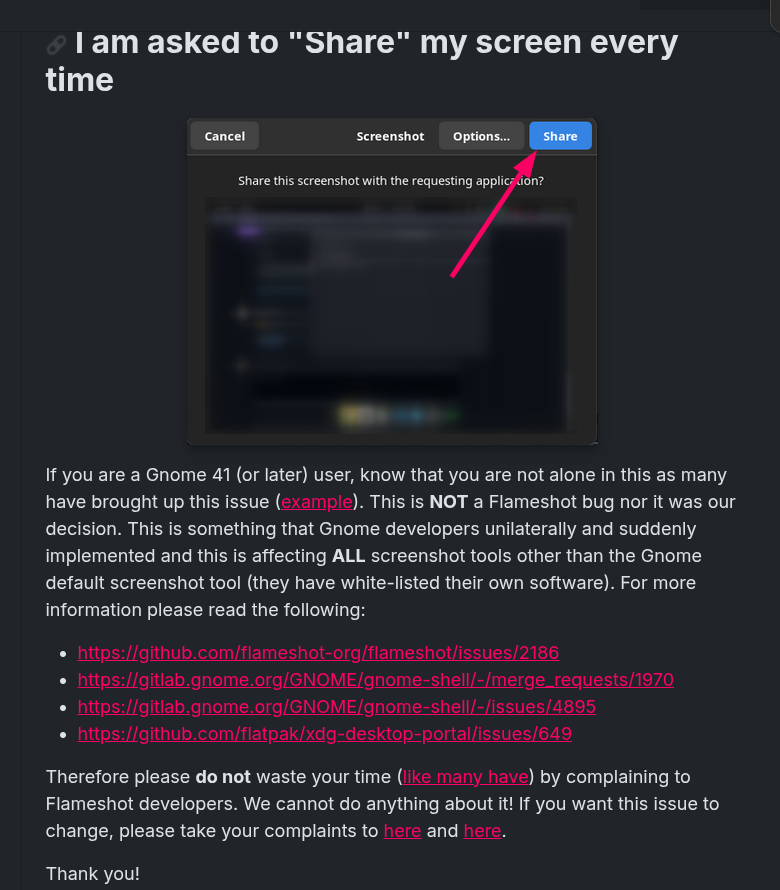
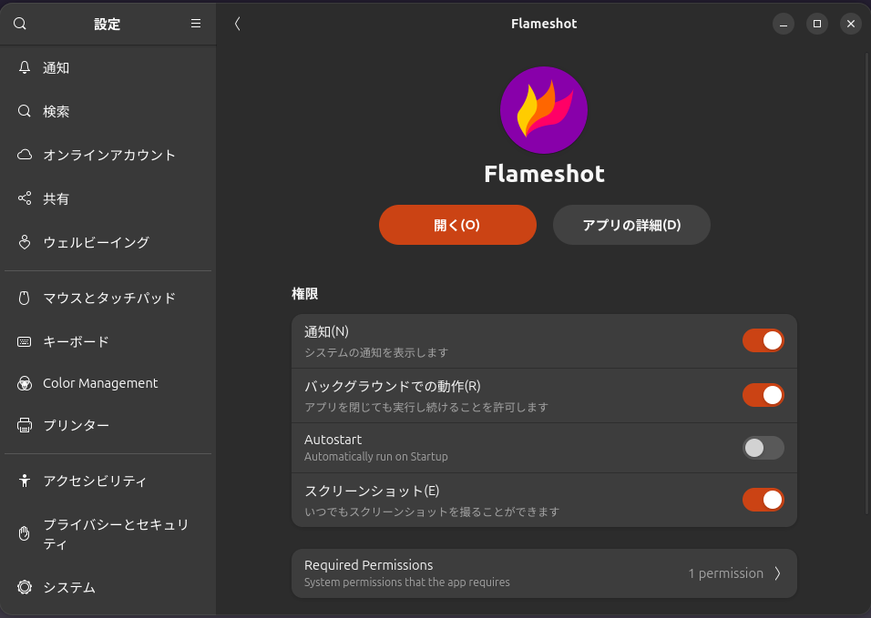

# GNOME WaylandでFlameshotを使えるようにする回避方法

# 前置き
この記事はQiita Advent Calendar 2025 / ひとりアドベントカレンダー 分野における ふぐおの配信関係多めひとり Advent Calendar 2025 の4日目記事となります。  

https://qiita.com/advent-calendar/2025/fuguo_2025

こんにちは! AI Tuberなどの開発をしているふぐおです。  
今日は、GNOMEでflameshotを使えるようにする方法についてお伝えします。  

# Flameshotとは？
様々なデスクトップOS上で動作するスクリーンショットツールです。  
Waylandで動作して、CLIからも操作できることから重宝しています。  

# GNOME WaylandではFlameshotが動かない？

GNOME WaylandでFlameshotを使う際に様々な問題が発生しています。  
公式サイトにも、GNOME側の問題であり、Flameshot側での対応は難しい旨が記載されています。  

# 回避方法
## 1. aptでのインストールではなく、FlatPak経由でインストールを行う。  
一応リンクを貼っときます。  

https://flathub.org/en/apps/org.flameshot.Flameshot

## 2 以下のコマンドを実行する。

```bash
flatpak permission-set screenshot screenshot org.flameshot.Flameshot yes
```
```
```

## 3. GNOMEの設定からFlameshotにスクリーンショットの権限が与えられているかを確認する。


aptでインストールすると、サンドボックス化されていない判定になって、スクリーンショットの権限が有効化できません。  

## 4. 以下のコマンドでFlameshotでスクリーンショットが撮れるか確認する。

```bash
flatpak run --command=flameshot org.flameshot.Flameshot gui
```

## 5. (パス指定をしたい場合)ストレージの許可を追加で与える。
flatpakでインストールした場合、パス指定機能を利用してもサンドボックス内に画像が保存されてしまうので、アクセス許可を与える必要があります。  

```bash
# ホームディレクトリ内の許可を与える場合
flatpak override --user --filesystem=home org.flameshot.Flameshot

# すべてのディレクトリに許可を与える場合
flatpak override --user --filesystem=host org.flameshot.Flameshot
```


以下のコマンドで、パス指定で保存できるか確認します。
```bash
flatpak run --command=flameshot org.flameshot.Flameshot full --path ./hoge.png
```

# まとめ
公式ドキュメントにはUbuntuはaptでインストールしてねと書かれていますが、Flatpakでインストールしよう。  

# 参考文献

https://github.com/flameshot-org/flameshot/issues/4017

# おまけ
ニコ生で毎日ライブコーディングしてます。来てね。

https://www.nicovideo.jp/user/98746932/live_programs?ref=watch_user_information
