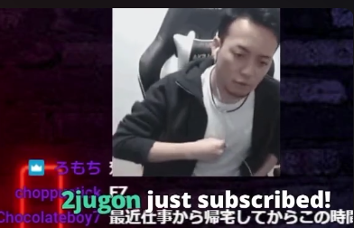
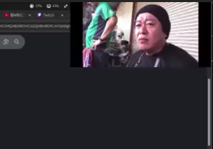
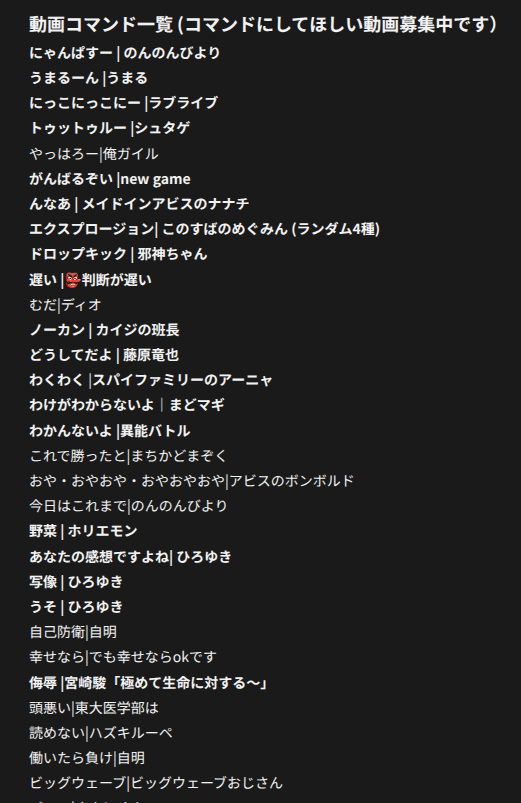

# Twitchでサブスクすると動画演出が流れる機能がTwitchくらいしか対応してなかったので自作した話

# はじめに
この記事はQiita Advent Calendar 2025 / ひとりアドベントカレンダー 分野における ふぐおの配信関係多めひとり Advent Calendar 2025 の8 日目の記事となります。  

https://qiita.com/advent-calendar/2025/fuguo_2025

こんにちは! AI Tuberなどの開発をしているふぐおです。  
私が作った**動画コマンドツール**について紹介したいと思います。  

# Twitchでサブスクすると動画演出が流れる機能について

  

[とある配信者さんなど](https://www.twitch.tv/vodkavdk)でサブスクをすると、こんな感じに動画が流れます。  
私が配信しているサイトも一応ギフトや広告といったものを投げると、演出は流れますが、配信者側でカスタマイズできません。  
配信者側でカスタマイズができると、**流れる演出から会話が広がったりする**ので、良い機能だと思います。  
おそらく、これは[StreamElements](https://streamelements.com/)と呼ばれるツールを使っていますが、こういうツールは**大抵YouTubeかTwitch**しか対応してません。  
私がメインで配信しているサイトで使えないのは悲しい！それなら、**自作**してしまおう！。  

# 作り方

## 基本的な仕組み
**OBSのブラウザソース機能**を使います。  
ブラウザソース機能で普段は**透明なHTMLを表示**しておき、**流したいタイミングでHTML上に動画を出現**させ、動画を**自動再生**し、再生が終わったら閉じるのを**JavaScript**で実装します。  
動画の**再生操作はSocket.IO**を使って、コメントを取得しているプロセスから動画再生Webページに送信します。  
**同じ技術**を使って、字幕の表示をする**記事**を書いたので、詳しくはこちらを参照してください。  

https://qiita.com/boxfish_jp/items/1ba6e22a3667f295a0fe

## 実装したコード
今回は**React**を使いました。  
React使わなくても全然できます。  
**前述の字幕記事はReact使っていない**ので、Reactを使わない場合はこちらを参照しつつ読み替えてください。

```tsx

import { useEffect, useRef, useState } from "react";
import { type Socket, io } from "socket.io-client";

const hostname = "localhost";
const port = "3002";

export const App = () => {
	const socketRef = useRef<Socket>();
	const [videoPath, setVideoPath] = useState<string>("");

	useEffect(() => {
		const socketUrl = `http://${hostname}:${port}`;
		const socket = io(socketUrl, { path: "/ws" });
		socketRef.current = socket;

		socket.on("connect", () => {
			console.log("connect");
		});

		socket.on("play", (videoName: string) => {
			setVideoPath(`../../video/${videoName}.mp4`);
		});

		return () => {
			if (socket.connected) {
				socket.disconnect();
			}
		};
	}, []);

	const onEnded = () => {
		setVideoPath("");
	};

	return (
		<>
			<section className="h-36 flex justify-end w-full">
				{videoPath && (
					// biome-ignore lint/a11y/useMediaCaption: <explanation>
					<video
						className="h-36"
						controls={false}
						onEnded={onEnded}
						src={videoPath}
						autoPlay={true}
					/>
				)}
			</section>
		</>
	);
};
```

## コード解説: 動画の表示部分
下のUI部分のロジックを見ると、`videoPath`**が空文字列でなければ、動画を表示する**ようになっています。  
つまり、再生指示が送られてない限り動画は表示されないので、透明な何もないソースになります。  

```tsx

socket.on("play", (videoName: string) => {
	setVideoPath(`../../video/${videoName}.mp4`);
});
```

動画の再生指示をSocket.IOで受け取ると、`setVideoPath`**で動画のパスをセット**します。  
今回私は面倒くさかったので、**ローカルファイルを使用**しています。  
ローカルファイルを使わないとWebサーバーを立ち上げて、Webページはもちろんのこと、動画まで全部配信する必要があるので。  

## コード解説: videoタグ部分

```tsx
<video
    className="h-36"
    controls={false}
    onEnded={onEnded}
    src={videoPath}
    autoPlay={true}
/>
```

`controls=false` で**動画の再生ボタンやシークバー**が配信画面に出るとダサいので**消しています**。  
`onEnded` は動画の再生が終了すると呼ばれます。今回は前述のとおり、`videoPath`が空文字だと動画が表示されなくなるので、動画の再生が終了すると空文字をセットすることで、**動画の表示を消しています**。これをやらないと、配信画面上に動画が残ったままになってしまうので。    
`autoPlay`を`true`にすることで、**動画が表示されたタイミングで自動再生**されるようになります。  

## 動画の再生指示を送るサーバー側の実装
今回は省略させてください。  
皆さんが使う配信サイトにもよりますし、配信者さんによって演出がほしいタイミングも違うと思いますので。  

# 実際に運用してみた

このシステムを**3年半ほど運用**してみました。  
3年半ほど運用しても、全く投げ銭をしてくれる人がいませんでした。  
システムを腐らせているのがもったいないので、**特定のワードをコメントに書き込むと動画が流れる**ようにしました。  
私がアニメ好きなこともあり、うちの視聴者さんはアニメ好きが多いので、アニメ関連などの動画が流れるようになっています。  
要望や私が好きな動画を追加していったら、動画の種類が90個になりました。 

  

私の配信にも遊びにきてね！

https://www.nicovideo.jp/user/98746932/live_programs

  

# まとめ
- Twitchは配信ツールが豊富で羨ましいなら、自作してしまえばいい  
- 流せる動画の種類数と視聴者の同接は比例しないらしい

# おまけ(OBSでローカルファイルとして読み込むために、ビルドファイルを一つにする方法)
Reactのページをビルドすると、`index.html`、`main.js`、`style.css`など複数のファイルが生成されます。  
このままだと面倒くさいので、index.htmlに全てのコードをまとめる方法を紹介します。  
やり方は簡単で、viteでビルドする際に[vite-plugin-singlefile](https://www.npmjs.com/package/vite-plugin-singlefile)を使うだけです。  
使い方は、[公式ページに乗っている](https://www.npmjs.com/package/vite-plugin-singlefile)のでそれを参照してください。  

