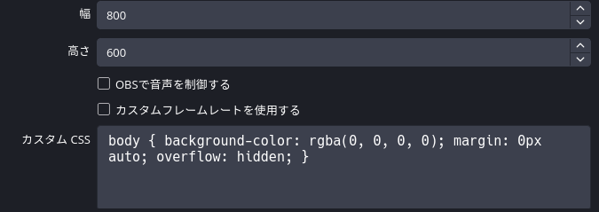
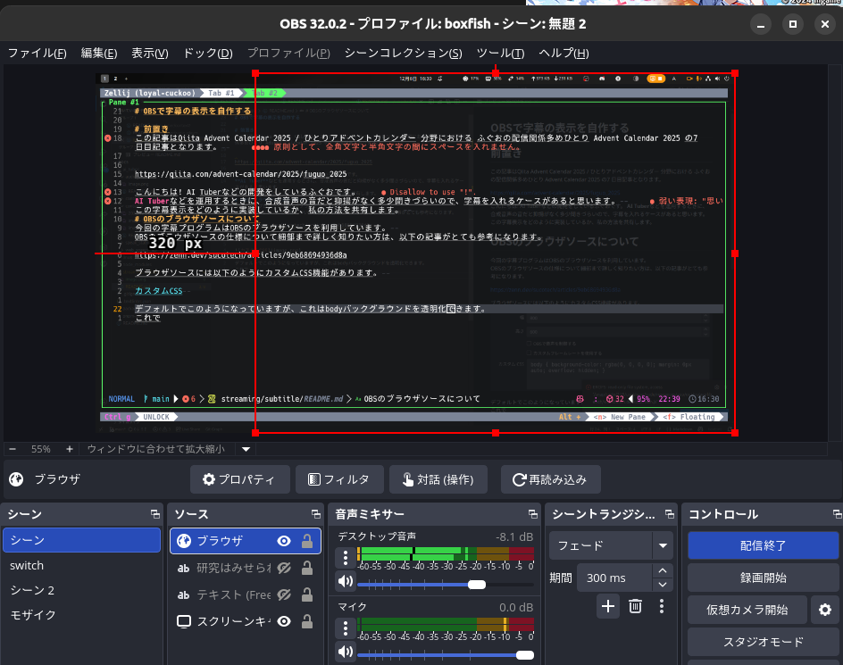
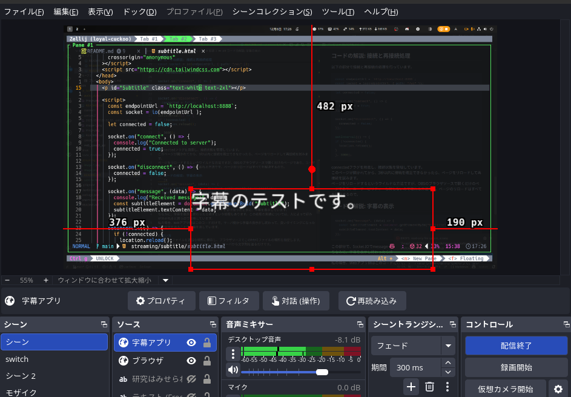

# OBSで字幕の表示を自作する

# 前置き
この記事はQiita Advent Calendar 2025 / ひとりアドベントカレンダー 分野における ふぐおの配信関係多めひとり Advent Calendar 2025 の7 日目記事となります。  

https://qiita.com/advent-calendar/2025/fuguo_2025

こんにちは! AI Tuberなどの開発をしているふぐおです。
**AI Tuber**などを運用するときに、合成音声そのままだと抑揚がなく多少聞きづらいので、**字幕**を入れるケースがあると思います。  
この字幕表示をどのように実装しているか、私の方法を共有します。  

# OBSのブラウザソースについて
今回の字幕プログラムはOBSの**ブラウザソース**を利用しています。  
OBSのブラウザソースの仕様について細部まで詳しく知りたい方は、以下の記事がとても参考になります。  

https://zenn.dev/sucotech/articles/9eb68694936d8a

ブラウザソースには以下のように**カスタムCSS機能**があります。  

  

デフォルトでこのようになっていますが、これはbodyバックグラウンドを透明化できます。  
レイヤーを重ねても透明なので、**裏が透過する**という面白いことができます。  



これを使って字幕表示するWebアプリを作ると、文字だけを浮かび上がらせることもできます。  

# 字幕Webアプリの作成

## サーバーの用意が必要
Webアプリ側に表示する字幕の情報を送信する必要がありますが、Webページに情報を渡すとなると、サーバーが必要となります。  
今回はSocket.IOを使用するので、localhostなどでPCの中に**Socket.IOのサーバーを立ててください**。  

## Socket.IOの選定理由
OBSのブラウザソースだとWebSocketが利用できないので、WebSocketは使っていません。  
そのため、WebSocketをHTTPロングポーリング感覚で使えるWebSocketを利用しています。    

# 実装
## 具体的なコード

```html
<!DOCTYPE html>
<html lang="ja">
  <head>
    <meta charset="UTF-8" />
    <meta name="viewport" content="width=device-width, initial-scale=1.0" />
    <title>Subtitle</title>
    <script
      src="https://cdn.socket.io/4.7.5/socket.io.min.js"
      integrity="sha384-2huaZvOR9iDzHqslqwpR87isEmrfxqyWOF7hr7BY6KG0+hVKLoEXMPUJw3ynWuhO"
      crossorigin="anonymous"
    ></script>
    <script src="https://cdn.tailwindcss.com"></script>
  </head>
  <body>
    <p id="Subtitle" class="text-white text-2xl"></p>

    <script>
      const endpointUrl = `http://localhost:8888`;
      const socket = io(endpointUrl, { path: "/ws" });

      let connected = false;

      socket.on("connect", () => {
        connected = true;
      });

      socket.on("disconnect", () => {
        connected = false;
      });

      socket.on("message", (data) => {
        const subtitleElement = document.getElementById("Subtitle");
        subtitleElement.textContent = data;
      });

      setInterval(() => {
        if (!connected) {
          location.reload();
        }
      }, 3000);
    </script>
  </body>
</html>
```

## コードの解説: Scriptタグ
scriptタグでSocket.IOとTailwindCSSを読み込んでいます。  
TailwindCSSは私のただの好みなだけなので、**普通のCSSでも全く問題はありません**。  

## コードの解説: 接続と再接続処理
以下の部分で接続と再接続の処理を行っています。  
```js
const endpointUrl = `http://localhost:8888`;
const socket = io(endpointUrl, { path: "/ws" });

let connected = false;

socket.on("connect", () => {
  connected = true;
});

socket.on("disconnect", () => {
  connected = false;
});

setInterval(() => {
if (!connected) {
  location.reload();
}
}, 3000);
```


connectedフラグを用意し、接続状態を管理しています。  
このページが開かれてから、**3秒以内に接続を確立できなかったら**、ページをリロードして**再接続**を試みます。  
ページをリロードするというワイルドな方法ですが、OBSのブラウザソースで開くだけのページであり、ユーザービリティも何もないので取れる方法です。ページのリロードはすべてを解決するので。  

## コードの解説: 字幕の表示
```js
socket.on("message", (data) => {
  const subtitleElement = document.getElementById("Subtitle");
  subtitleElement.textContent = data;
});
```

この部分で、Socket.IOでmessageイベントを受け取ったときに、字幕を表示しています。  
ちなみに、字幕を表示を終わったら消すという処理もあります。この処理の実装については、人によって好みが分かれると思うので省略しています。  
私の場合、Webアプリ側はこのコードだけで、サーバ側から字幕の表示がし終わって、良いタイミングになったら空文字を送ることで字幕を消しています。  

# 使い方
このhtmlファイルを適当な場所に保存し、ブラウザソースでこのhtmlファイルの場所を指定します。  
あとはSocket.IOのサーバーを立ち上げて、サーバから文字列を送るだけです。  

  

こんな感じの見た目になります。  
見た目をもっとリッチにしてみたり遊んでみてください。  

# まとめ
OBSのブラウザソースはかなり遊べる。  


# おまけ
ニコ生で毎日ライブコーディングしてます。来てね。

https://www.nicovideo.jp/user/98746932/live_programs?ref=watch_user_information
